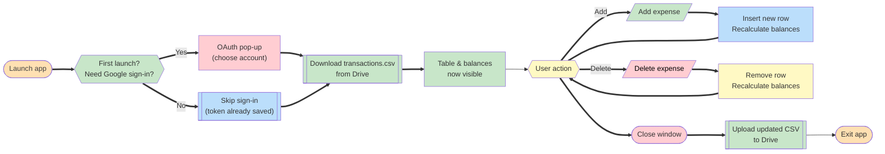

```mermaid
%%{ init: { theme: "default", flowchart: { layout: "dagre" } } }%%
flowchart LR
    A(["Launch app"]) ==> B{{"First launch?<br/>Need Google sign-in?"}}
    B == Yes ==> C["OAuth pop-up<br/>(choose account)"]
    C ==> E[["Download transactions.csv<br/>from Drive"]]
    B == No ==> D[["Skip sign-in<br/>(token already saved)"]]
    D ==> E
    E ==> F["Table & balances<br/>now visible"]
    F --> G{{"User action"}}
    G == Add ==> H[/"Add expense"/]
    H ==> I["Insert new row<br/>Recalculate balances"]
    I === G
    G == Delete ==> J[/"Delete expense"/]
    J ==> K["Remove row<br/>Recalculate balances"]
    K ==> G
    G ==> L(["Close window"])
    L ==> M[["Upload updated CSV<br/>to Drive"]]
    M --> N(["Exit app"])
    %%  colours (keep if you like – they inline fine)
    style A fill:#FFE0B2,color:#424242
    style B fill:#C8E6C9
    style C fill:#FFCDD2
    style D fill:#BBDEFB
    style E fill:#C8E6C9
    style F fill:#C8E6C9
    style G fill:#FFF9C4
    style H fill:#C8E6C9
    style I fill:#BBDEFB
    style J fill:#FFCDD2,color:#000
    style K fill:#FFF9C4
    style L fill:#FFCDD2
    style M fill:#C8E6C9
    style N fill:#FFE0B2
```